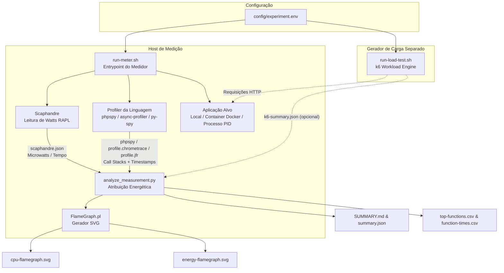
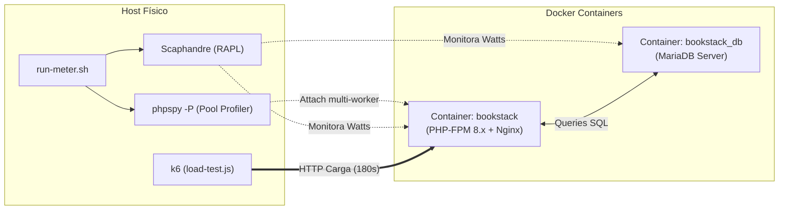

# Green Energy Lab — Medidor Multi-Linguagem de Energia e Performance

O **Green Energy Lab** é uma ferramenta de perfilamento e medição de consumo energético e emissões de carbono para aplicações de software em sistemas Linux nativos.

Ele integra medição direta de hardware via contadores Intel/AMD RAPL (**Scaphandre**), perfilamento de pilhas de chamadas em tempo de execução (**phpspy** para PHP, e extensível para Java e Python), geração de perfil visual (**FlameGraph**), testes de carga desacoplados (**k6**) e um analisador estatístico em Python (`analyze_measurement.py`) que correlaciona o consumo elétrico com o código executado.

---

## 📋 Sumário
1. [Requisito Fundamental](#-requisito-fundamental)
2. [Arquitetura e Fluxo Desacoplado](#-arquitetura-e-fluxo-desacoplado)
3. [Pronto para Fusão Multi-Linguagem (PHP, Java, Python)](#-pronto-para-fusão-multi-linguagem-php-java-python)
4. [Guia de Início Rápido (Quickstart)](#-guia-de-início-rápido-quickstart)
5. [Modos de Execução do Medidor (`run-meter.sh`)](#-modos-de-execução-do-medidor-run-metersh)
6. [🐳 Suporte a Containers Docker e Pools Multi-Processo (PHP-FPM)](#-suporte-a-containers-docker-e-pools-multi-processo-php-fpm)
7. [📚 Estudo de Caso: Medindo o BookStack (Laravel + Docker + MariaDB)](#-estudo-de-caso-medindo-o-bookstack-laravel--docker--mariadb)
8. [Filtro de Escopo da Aplicação (Application Scope Filtering)](#-filtro-de-escopo-da-aplicação-application-scope-filtering)
9. [Execução Separada do Teste de Carga (`run-load-test.sh` / `k6`)](#-execução-separada-do-teste-de-carga-run-load-testsh)
10. [Painel Visual Interativo](#-painel-visual-interativo)
11. [Configuração (`config/experiment.env`)](#-configuração-configexperimentenv)
12. [Estrutura do Repositório](#-estrutura-do-repositório)
13. [Calculadora de Carbono (`carbon.py`)](#-calculadora-de-carbono-carbonpy)
14. [Boas Práticas de Medição](#-boas-práticas-de-medição)
15. [🏛️ Guia Especializado: Medição na STI / UFPB (SIGAA, SIPAC, Portais)](#-guia-especializado-medição-na-sti--ufpb-sigaa-sipac-portais)

---

## ⚠️ Requisito Fundamental

> [!IMPORTANT]
> **Use Linux nativo instalado no computador físico.**
> 
> **Não use WSL nem Máquinas Virtuais comuns** para realizar as medições reais de energia. O Scaphandre depende das interfaces RAPL (Running Average Power Limit) fornecidas pelo kernel Linux (`/sys/class/powercap`), que normalmente **não são expostas** por hipervisores ou pelo WSL.

Requisitos adicionais:
- Privilégios de **`sudo`** para acessar os contadores de hardware RAPL e ler memória de processos via `process_vm_readv`.
- Para PHP: PHP compilado **sem Thread Safety (Non-ZTS)** para compatibilidade com o profiler `phpspy`.

---

## 🏗 Arquitetura e Fluxo Desacoplado

O sistema adota uma separação estrita de responsabilidades: **Medição** e **Geração de Carga** são processos totalmente independentes. Isso permite executar o gerador de tráfego HTTP (`k6`) em um computador ou terminal separado, garantindo que o consumo de CPU do `k6` não interfira nas leituras de energia do servidor sob teste.



---

## 🌐 Suporte Multi-Linguagem Integrado (PHP, Java, Python)

O medidor unifica os três ecossistemas em uma interface padronizada de linha de comando:

```bash
./run-meter.sh --language <php|java|python> --mode <local|container|process>
```

- **PHP** *(Ativo)*: Utiliza amostragem de pilhas de execução via `phpspy` a 99 Hz + medição RAPL com Scaphandre.
- **Java** *(Ativo)*: Utiliza perfilamento nativo da JVM via `async-profiler` (formato JFR) + parser JDK `jfr` + medição RAPL.
- **Python** *(Ativo)*: Utiliza amostragem de pilhas em tempo real via `py-spy` (formato chrometrace) + medição RAPL.

---

## 🚀 Guia de Início Rápido (Quickstart)

### 1. Instalar Ferramentas Necessárias
Execute o script de instalação (requer Ubuntu/Debian Linux nativo):
```bash
./measurement/install-tools-ubuntu.sh
```

### 2. Verificar o Ambiente
Confirme que o hardware e o kernel atendem a todos os requisitos:
```bash
./measurement/check-environment.sh
```

### 3. Iniciar o Medidor (Terminal 1)
Inicie a medição informando a linguagem e o modo desejado:

```bash
# Exemplo 1: Aplicação PHP local
./run-meter.sh --language php --mode local

# Exemplo 2: Aplicação Python local
./run-meter.sh --language python --mode local

# Exemplo 3: Aplicação Java local
./run-meter.sh --language java --mode local
```
*O script coletará o consumo em repouso (baseline) e abrirá a janela de medição pelo tempo configurado.*

### 4. Executar o Teste de Carga (Terminal 2 ou Máquina Remota)
Durante a janela de medição aberta no Terminal 1, envie o tráfego de carga:
```bash
./run-load-test.sh
```

Ao término, os relatórios completos e Flamegraphs estarão disponíveis no diretório `results/<linguagem>-<modo>-YYYYMMDD-HHMMSS/`.

---

## 🎯 Modos de Execução do Medidor (`run-meter.sh`)

O medidor suporta três formas de execução para **PHP**, **Java** e **Python**:

### 1. Modo Local (`--mode local`)
Inicia automaticamente o servidor de aplicação local e anexa o profiler ao processo criado:
```bash
# PHP (servidor embutido)
./run-meter.sh --language php --mode local

# Python (servidor de teste padrão ou customizado via --app-cmd)
./run-meter.sh --language python --mode local

# Java (servidor de teste padrão ou customizado via --app-cmd)
./run-meter.sh --language java --mode local
```

### 2. Modo Container Docker (`--mode container`)
Identifica o PID do container no Host Linux através de `docker inspect` e monitora o container diretamente pelo Host:
```bash
# Container PHP (ex: WordPress, Laravel, etc.)
./run-meter.sh --language php --mode container -c nome_container_php

# Container Python (ex: FastAPI, Django, Flask)
./run-meter.sh --language python --mode container -c nome_container_python

# Container Java (ex: Spring Boot, Quarkus)
./run-meter.sh --language java --mode container -c nome_container_java
```

### 3. Modo Processo Específico (`--mode process`)
Conecta os coletores diretamente a um processo existente no Linux através do seu PID:
```bash
# Processo PHP
./run-meter.sh --language php --mode process -p 12345

# Processo Python
./run-meter.sh --language python --mode process -p 23456

# Processo Java (JVM)
./run-meter.sh --language java --mode process -p 34567
```

### Opções do `run-meter.sh`:
| Parâmetro | Descrição | Padrão |
|---|---|---|
| `-l, --language <lang>` | Linguagem da aplicação (`php`, `java`, `python`) | `php` |
| `-m, --mode <mode>` | Modo de execução (`local`, `container`, `process`) | `local` |
| `-c, --container <nome>` | Nome ou ID do container Docker (para modo container) | - |
| `-p, --pid <pid>` | PID do processo alvo no Host (para modo process) | - |
| `--port <porta>` | Porta TCP para execução do servidor no modo local | `8080` |
| `--host <host>` | Endereço de host para o servidor local | `127.0.0.1` |
| `--app-cmd <comando>` | Comando customizado para iniciar a aplicação localmente | - |
| `-d, --duration <seg>` | Duração da janela de medição em segundos | `60` |
| `-b, --baseline <seg>` | Duração da medição em repouso (*baseline*) | `15` |
| `-o, --output <dir>` | Diretório customizado de saída para os resultados | `results/...` |
| `--prefix, --application-prefix <prefs>` | Filtra funções por um ou múltiplos prefixos separados por vírgula (ex: `api,service` ou `App\,Domain\`) | - |
| `--project-root <dir>` | Raiz do código-fonte para qualificação dos frames | - |
| `--config <arquivo>` | Caminho do arquivo de configuração `.env` | `config/experiment.env` |
| `--k6 <arquivo>` | Caminho do resumo gerado pelo k6 (`k6-summary.json`) | `results/k6-summary.json` |

---

## 🐳 Suporte a Containers Docker e Pools Multi-Processo (PHP-FPM)

Em aplicações PHP de produção (Laravel, WordPress, BookStack, Drupal), o servidor opera tipicamente através de um gerenciador de processos como o **PHP-FPM** operando em modo dinâmico (`pm = dynamic` ou `pm = ondemand`), frequentemente orquestrado por supervisores de container como **s6-overlay**, **systemd**, **supervisord** ou **tini**.

### O Desafio da Reciclagem de Processos (*Worker Recycling*)
Conforme a carga de requisições varia e ultrapassa os limites configurados (`pm.max_requests` ou concorrência do `k6`):
1. O PHP-FPM cria e destrói processos workers dinamicamente.
2. Anexar o profiler a um único PID efêmero (`-p PID`) faz com que o perfilamento seja **interrompido abruptamente** assim que aquele worker específico é reciclado.
3. Se houver um vácuo de amostragem durante o encerramento do processo, algoritmos ingênuos de interpolação trapezoidal podem esticar linearmente a energia de dezenas de segundos sobre as poucas funções capturadas nos momentos finais, distorcendo os relatórios e inflando métricas.

### 🛠 O que foi Implementado e Corrigido no Medidor:

1. **Profiling Concorrente de Pool (`phpspy -P`)**:
   Em modo container, o medidor utiliza `-P "php-fpm|php"` com múltiplas threads (`-T 16`), modo tolerante a falhas (`-c`) e sincronização por mutex (`-J m`). O profiler rastreia simultaneamente todos os workers ativos e anexa automaticamente aos novos workers que nascem durante picos de estresse.

2. **Agregação Temporal no Scaphandre**:
   O [analyze_measurement.py](file:///home/vinicius/Documentos/Verdize/green-php-lab-meter-ready/measurement/analyze_measurement.py) agrupa a potência de todos os processos da aplicação por timestamp de snapshot de relatório, somando o consumo elétrico de todo o cluster de workers e processos filhos.

3. **Proteção contra Gaps de Amostragem (`max_interval_gap_s = 3.0s`)**:
   Caso ocorra alguma descontinuidade na amostragem de hardware, o integrador classifica o intervalo como *unattributed*, impedindo que funções pontuais (como providers de boot) recebam custos energéticos indevidos.

4. **Resolução de Processos Ignorando Supervisores**:
   O [run-meter.sh](file:///home/vinicius/Documentos/Verdize/green-php-lab-meter-ready/measurement/run-meter.sh) inspeciona os processos do container via `docker top`, filtrando executáveis de supervisão (`s6-svscan`, `s6-supervise`, `s6-linux-init`) e capturando os processos de aplicação reais.

---

## 📚 Estudo de Caso: Medindo o BookStack (Laravel + Docker + MariaDB)

O **BookStack** é uma plataforma de documentação e wiki construída sobre o framework **Laravel**, com persistência em **MySQL/MariaDB** e servida via **PHP-FPM + Nginx**.



### Passo a Passo para Medir o BookStack:

#### 1. Iniciar os Containers da Aplicação
Certifique-se de que os containers da aplicação e do banco estão em execução:
```bash
docker ps
```
*(Exemplo: containers `bookstack` na porta `6875` e `bookstack_db`).*

#### 2. Configurar o Teste de Carga ([load-test.js](file:///home/vinicius/Documentos/Verdize/green-php-lab-meter-ready/load-test.js))
O script de teste de carga deve simular o uso real do sistema, incluindo autenticação com extração de token CSRF do Laravel:
* **60% do tráfego**: Navegação e leitura de livros/estantes (`/books`, `/shelves`).
* **20% do tráfego**: Busca textual (`/search?term=...`), gerando carga nas queries do MariaDB.
* **20% do tráfego**: Fluxo completo de login (`/login` com POST e sessão autenticada).

#### 3. Iniciar o Medidor (Terminal 1)
Execute o medidor com a duração correspondente à rampa do k6 (ex: 180s) e filtre pelo namespace `BookStack\`:
```bash
./run-meter.sh \
  --language php \
  --mode container \
  -c bookstack \
  --application-prefix "BookStack\\" \
  --project-root . \
  -d 180 \
  -b 15
```

#### 4. Executar o Teste de Carga (Terminal 2)
Assim que o Terminal 1 iniciar a janela de medição, dispare o tráfego:
```bash
k6 run load-test.js
```

#### 5. Interpretação dos Resultados Gerados

Ao final da execução, abra o relatório em `results/php-container-YYYYMMDD-HHMMSS/SUMMARY.md`:
* **Separação de Camadas**: O Scaphandre isola o custo do runtime do PHP-FPM (geralmente ~85-90% do total) e das consultas do MariaDB (~10-15%).
* **Custo por Requisição**: Métrica fundamental de *Green Software* expressa em **Joules por Requisição** (ex: `~0,55 J/req` no PHP e `~0,62 J/req` na stack completa).
* **Hotspots de Negócio**: Identifique nos relatórios e no `energy-flamegraph.svg` quais middlewares, controllers de autenticação ou queries acumulam maior pegada energética.

---

## 🎯 Filtro de Escopo da Aplicação (Application Scope Filtering)

Em ecossistemas modernos (Laravel, Django, FastAPI, Spring Boot), grande parte das chamadas capturadas pelos profilers pertence à infraestrutura (middlewares internos, roteamento, serializadores, ORMs, chamadas de sistema ou bibliotecas de terceiros).

Para guiar a **refatoração verde (*Green Refactoring*)**, o medidor possui um mecanismo de **filtro de escopo multi-prefixo** agnóstico à linguagem que isola as funções de negócio da aplicação e agrupa o restante sob o rótulo `[framework/language overhead]`.

### Suporte a Múltiplos Prefixos (Separados por Vírgula):

Você pode especificar um ou múltiplos prefixos separados por vírgula (`prefixo1,prefixo2,prefixo3`). O analisador verifica se a função inicia com **qualquer um** dos prefixos configurados.

```bash
# Python: filtra múltiplos módulos / sub-apps de negócio (ex: Django/FastAPI)
./run-meter.sh --language python --mode container -c backend \
  --project-root /code \
  --application-prefix "api,librephotos,service,image_similarity"

# PHP: filtra múltiplos namespaces do sistema
./run-meter.sh --language php --mode local \
  --project-root . \
  --application-prefix "App\\,BookStack\\,Domain\\"

# Java: filtra múltiplos pacotes do projeto (Spring Boot, Microsserviços)
./run-meter.sh --language java --mode local \
  --application-prefix "com.minhaempresa.servico,com.minhaempresa.controlador,br.ufpb"
```

Ou configure diretamente no arquivo de ambiente (ex: `config/experiment.env` ou `config/librephotos.env`):
```env
APPLICATION_PREFIX=api,librephotos,service,image_similarity
PROJECT_ROOT=/code
```

### Como o Analisador Trata os Escopos:
1. **Funções no Escopo:** Têm suas métricas de energia (`Self Energy` e `Inclusive Energy`) e tempo de execução contabilizados detalhadamente no `SUMMARY.md`, `summary.json` e `top-functions.csv`.
2. **Funções Fora do Escopo:** São colapsadas e consolidadas automaticamente como `[framework/language overhead]` nos FlameGraphs interativos (`energy-flamegraph.svg` e `cpu-flamegraph.svg`), evitando ruído visual de frameworks.

### Como Interpretar os Relatórios (`SUMMARY.md` e `top-functions.csv`):

| Métrica | Significado | Como Usar na Otimização |
|---|---|---|
| **Self Energy (J)** | Energia consumida **diretamente dentro do corpo da função** (excluindo chamadas filhas). | **Alvo nº 1 de otimização algorítmica**. Indica quais funções gastam mais CPU ativa internamente. |
| **Inclusive Energy (J)** | Energia da função **mais** toda a cadeia de chamadas que ela disparou. | **Alvo de otimização de arquitetura/fluxo**. Indica quais rotas ou controllers acumulam mais custo elétrico total. |
| **Average Time (ms/req)** | Latência média adicionada à requisição por aquela função. | Ajuda a verificar se a lentidão da API está diretamente associada ao alto consumo de Joules. |

---

## ⚡ Execução Separada do Teste de Carga (`run-load-test.sh`)

O script `run-load-test.sh` executa o `k6` de forma independente:

```bash
# Executar workload padrão do experiment.env (WordPress login/admin ou sintético)
./run-load-test.sh

# Executar workload sintético específico (cpu, text, mixed)
./run-load-test.sh cpu

# Executar apontando para porta e taxa customizadas com carga mais intensa
./run-load-test.sh cpu --url http://127.0.0.1:8000 --rate 20 --scale 5 --duration 30
```

### Opções do `run-load-test.sh`:
| Parâmetro | Descrição | Padrão |
|---|---|---|
| `-u, --url <url>` | URL base da aplicação sob teste | `http://127.0.0.1:8080` |
| `-w, --workload <tipo>` | Tipo de carga (`wordpress`, `cpu`, `text`, `mixed`, `login`) | `wordpress` |
| `-r, --rate <req/s>` | Taxa constante de requisições por segundo | `2` |
| `-d, --duration <seg>` | Duração do teste de carga em segundos | `60` |
| `-s, --scale <escala>` | Fator de escala do peso computacional (1 a 5) | `1` |
| `--warmup <seg>` | Duração de aquecimento prévio opcional | `0` |
| `--user <user>` / `--pass <pass>` | Credenciais para o teste de login no WordPress | `marcos` / `Teste1234` |
| `-o, --output <arquivo>` | Caminho para salvar o `k6-summary.json` | `results/k6-summary.json` |

---

## 📊 Painel Visual Interativo

O projeto conta com um painel web interativo para visualização de resultados:

1. Inicie o servidor da interface:
```bash
./scripts/start-server.sh
```
2. Abra o navegador em `http://127.0.0.1:8080/`.
3. Navegue pelas execuções passadas no menu lateral e visualize:
   - **Métricas de Energia**: Total do Host, Total do Processo e Energia Dinâmica (com desconto de baseline).
   - **Potência Média (Watts)** e **Emissões de Carbono Estimadas ($g\text{CO}_2e$)**.
   - **Flamegraph Interativo de Energia**: Atribuição de microjoules por função.
   - **Flamegraph Interativo de CPU**: Amostras de tempo de execução por pilha de chamadas.

---

## ⚙️ Configuração (`config/experiment.env`)

O arquivo `config/experiment.env` centraliza as configurações padrão:

```env
TARGET_LANGUAGE=php
MODE=local

HOST=127.0.0.1
PORT=8080
BASE_URL=http://127.0.0.1:8080

WORKLOAD=wordpress
WP_USER=marcos
WP_PASS=Teste1234
SCALE=1
RATE=2

DURATION_SECONDS=60
WARMUP_SECONDS=10
BASELINE_SECONDS=15
COLLECTOR_LEAD_SECONDS=3
COLLECTOR_TAIL_SECONDS=5

PHPSPY_RATE_HZ=99
SCAPHANDRE_STEP_SECONDS=1
SCAPHANDRE_PROCESS_REGEX="(php|mysqld|mariadbd|apache2)"
SCAPHANDRE_MAX_PROCESSES=100

CARBON_INTENSITY_G_PER_KWH=100
```

---

## 📁 Estrutura do Repositório

```text
green-php-lab-meter-ready/
├── README.md                   # Documentação do projeto
├── run-meter.sh                # Entrypoint universal do medidor (PHP, Java, Python)
├── run-load-test.sh            # Entrypoint do gerador de carga (k6)
├── carbon.py                   # Calculadora standalone de emissões de carbono
├── k6.js                       # Script de teste de carga constante do k6
├── load-test.js                # Teste de carga com autenticação CSRF para BookStack
├── config/
│   ├── experiment.env          # Configuração padrão de teste
│   ├── ufpb-sigaa.env          # Configuração pronta para o SIGAA (Java/Tomcat)
│   ├── ufpb-sipac.env          # Configuração pronta para o SIPAC (Java/Tomcat)
│   ├── ufpb-portal-php.env     # Configuração pronta para o Portal Institucional (PHP)
│   ├── ufpb-api-python.env     # Configuração pronta para APIs STI (FastAPI/Django)
│   └── ufpb-hypervisor-host.env# Configuração para nó de Data Center / Proxmox
├── docs/
│   └── STI_UFPB_GUIDE.md       # Guia completo para medição nos sistemas da UFPB
├── sigaa-load-test.js          # Teste de carga k6 para o SIGAA
├── sipac-load-test.js          # Teste de carga k6 para o SIPAC
├── ufpb-portal-load-test.js    # Teste de carga k6 para o Portal UFPB
├── measurement/
│   ├── run-meter.sh            # Engine de medição e acoplamento de coletores
│   ├── run-load-test.sh        # Engine de execução do k6
│   ├── analyze_measurement.py  # Analisador de correlação temporal de energia e stacks
│   ├── check-environment.sh    # Validação do ambiente e contadores RAPL
│   ├── install-tools-ubuntu.sh # Instalador de dependências no Ubuntu Linux
│   ├── test-analyzer.sh        # Testes automatizados do analisador
│   └── test-fixtures/         # Conjunto de dados de teste para validação
├── public/
│   └── index.php               # Aplicação PHP de teste e painel visual interativo
├── scripts/
│   └── start-server.sh         # Utilitário para iniciar o painel web
├── tools/
│   ├── FlameGraph/             # Renderizador SVG de Flamegraphs
│   └── phpspy/                 # Profiler de call stacks para PHP
└── results/                    # Diretório onde são gravados os relatórios de medição
```

---

## 🧮 Calculadora de Carbono (`carbon.py`)

Utilitário de linha de comando para conversão direta de Joules em emissões operacionais, com suporte a presets regionais da matriz elétrica brasileira (**SIN**):

```bash
# Cálculo usando o fator regional do Nordeste (UFPB / PB ~45.2 gCO2e/kWh):
python3 carbon.py --energy-j 1250.5 --preset ufpb --requests 250

# Cálculo usando a média nacional do SIN (61.7 gCO2e/kWh):
python3 carbon.py --energy-j 1250.5 --preset sin-brasil --requests 250
```

---

## 📌 Boas Práticas de Medição

1. **Desacoplamento de Carga**: Execute o gerador `run-load-test.sh` em um computador cliente separado na rede para garantir isolamento elétrico completo dos contadores RAPL.
2. **Repetição de Medições**: Realize no mínimo 5 repetições para cada medição experimental a fim de obter significância estatística.
3. **Desconto de Baseline**: O medidor desconta automaticamente a taxa de consumo elétrico da máquina em repouso (*idle baseline*), gerando a métrica de **energia dinâmica**.

---

## 🏛️ Guia Especializado: Medição na STI / UFPB (SIGAA, SIPAC, Portais)

Para executar medições completas na infraestrutura e nos sistemas da **STI / UFPB**, consulte o guia dedicado em:
👉 **[`docs/STI_UFPB_GUIDE.md`](docs/STI_UFPB_GUIDE.md)**

O repositório inclui suporte pré-configurado para:
* **Ambiente Staging / Bare-Metal:** Perfilar containers Docker do SIGAA, SIPAC, Portal ou APIs Python com contadores RAPL nativos.
* **Nós Hypervisor (Proxmox/KVM):** Monitorar o gasto energético total do servidor físico e isolar os Watts de cada VM corporativa.
* **Workloads k6 reais:** Cenários que simulam navegação discente, consulta de notas, emissão de histórico/declarações (PDF) e tramitação de processos.

