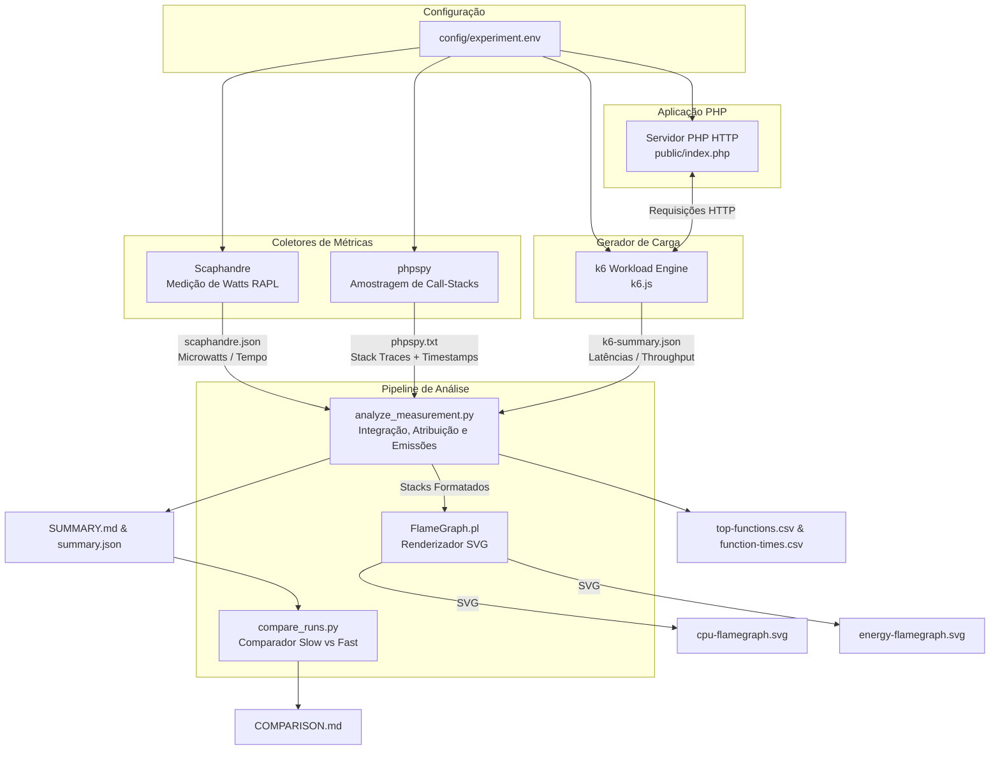

# Green PHP Lab — Scaphandre + phpspy

O **Green PHP Lab** é um ambiente completo de medição, perfilamento e atribuição de consumo energético e emissões de carbono para aplicações PHP em sistemas Linux.

Ele integra medição de hardware via contadores RAPL (**Scaphandre**), amostragem de pilhas de execução em tempo de execução (**phpspy**), geração de perfil visual (**FlameGraph**), testes de carga reprodutíveis a uma taxa constante de requisições (**k6**) e um analisador estatístico em Python (`analyze_measurement.py`) que correlaciona o consumo elétrico com o código executado.

---

## 📋 Sumário
1. [Requisito Fundamental](#-requisito-fundamental)
2. [Arquitetura e Fluxo de Funcionamento](#-arquitetura-e-fluxo-de-funcionamento)
3. [Principais Funcionalidades](#-principais-funcionalidades)
4. [Como Funciona em Detalhes](#-como-funciona-em-detalhes)
5. [Guia de Início Rápido (Quickstart)](#-guia-de-início-rápido-quickstart)
6. [Configuração do Experimento](#-configuração-do-experimento)
7. [Estrutura dos Arquivos de Resultado](#-estrutura-dos-arquivos-de-resultado)
8. [Estrutura do Repositório](#-estrutura-do-repositório)
9. [Calculadora de Carbono (`carbon.py`)](#-calculadora-de-carbono-carbonpy)
10. [Limitações de Interpretação e Boas Práticas](#-limitações-de-interpretação-e-boas-práticas)

---

## ⚠️ Requisito Fundamental

> [!IMPORTANT]
> **Use Linux nativo instalado no computador físico.**
> 
> **Não use WSL (Windows Subsystem for Linux) nem Máquinas Virtuais comuns** para realizar as medições reais de energia. O Scaphandre depende das interfaces RAPL (Running Average Power Limit) fornecidas pelo kernel Linux (`/sys/class/powercap`), que normalmente **não são expostas** por hipervisores ou pelo WSL.

Além do Linux nativo:
- O PHP deve ser compilado **sem Thread Safety (Non-ZTS)** para compatibilidade com o `phpspy`.
- É necessário ter privilégios de **`sudo`** para acessar os contadores de hardware RAPL e ler a memória de processos via `process_vm_readv`.

---

## 🏗 Arquitetura e Fluxo de Funcionamento

O diagrama abaixo ilustra a integração de todos os componentes durante uma medição:



---

## ✨ Principais Funcionalidades

- **Medição Energética Baseada em Hardware**: Captura o consumo de energia em tempo real do host completo e de processos PHP específicos utilizando o recurso Intel/AMD RAPL via Scaphandre.
- **Perfilamento de Chamadas (Profiling)**: Coleta pilhas de chamadas (*call stacks*) do servidor PHP em alta frequência (padrão de 99 Hz) através do `phpspy`, sem a necessidade de modificar o código-fonte da aplicação ou instalar extensões pesadas no PHP.
- **Desconto de Baseline (Dynamic Energy)**: Mede o consumo de energia da máquina em repouso (*idle baseline*) antes do teste de carga e subtrai essa taxa do consumo total, isolando a **energia dinâmica** consumida exclusivamente pelo processamento da requisição.
- **Atribuição Energética por Função**: Realiza a correlação temporal entre os pontos de consumo em microwatts (Scaphandre) e os traces de execução (phpspy), atribuindo Joules diretamente a cada função e pilha de chamadas.
- **Flamegraphs de Energia e CPU**:
  - `cpu-flamegraph.svg`: Mostra em qual função a aplicação passou mais tempo de CPU.
  - `energy-flamegraph.svg`: Mostra em qual função a aplicação consumiu mais microjoules de energia.
- **Relatórios Granulares em CSV**:
  - `top-functions.csv`: Ranqueamento completo de funções por consumo de energia em Joules (*self* e *inclusive*) e porcentagem de impacto no processo PHP.
  - `function-times.csv`: Métricas detalhadas de tempo de execução por função (tempo total em segundos, tempo próprio, tempo inclusivo e duração média em milissegundos por requisição).
- **Estimativa de Emissões de Carbono Operacionais**: Converte Joules consumidos para kWh e calcula as emissões de dióxido de carbono equivalente ($g\text{CO}_2e$) com base na intensidade de carbono da matriz elétrica local ($g\text{CO}_2e/\text{kWh}$).
- **Carga de Trabalho Estável (Constant Arrival Rate)**: O `k6` impõe um volume estritamente controlado de requisições por segundo, garantindo comparabilidade justa entre execuções.
- **Comparação Automatizada (Slow vs Fast)**: O script `run-comparison.sh` executa as versões não otimizada (`slow`) e otimizada (`fast`), calcula a equivalência de resultados e gera um relatório detalhado (`COMPARISON.md`) utilizando a tabela `function-times.csv` para comparar as reduções percentuais de tempo e energia por função.

---

## 🔬 Como Funciona em Detalhes

### 1. Inicialização e Verificação de Equivalência
O servidor embutido do PHP (`php -S`) é iniciado no endereço especificado (ex: `127.0.0.1:8080`). Antes da medição, o script `verify-equivalence.sh` realiza requisições de teste para garantir que ambas as implementações (`slow` e `fast`) gerem exatamente os mesmos resultados matemáticos e de texto (checagem de *checksum* e contagens).

### 2. Aquecimento (*Warm-up*)
Um pré-teste curto com o `k6` aquece os caches de instrução do sistema operacional e da máquina virtual PHP, evitando viés de inicialização fria nas medições.

### 3. Medição de Baseline (*Idle Baseline*)
O Scaphandre é executado durante alguns segundos sem nenhuma requisição HTTP sendo enviada para a aplicação. Essa medição registra a taxa de consumo de energia em repouso do sistema e do processo PHP.

### 4. Coleta Concorrente de Dados
Durante a execução do workload de produção com `k6`:
- **Scaphandre**: Coleta amostras de consumo elétrico (em microwatts) a cada intervalo regular (ex: 1 segundo).
- **phpspy**: Amostra as pilhas de chamadas ativas do processo PHP a 99 Hz, atribuindo um *timestamp* preciso a cada *stack trace*.
- **k6**: Executa o número exato de requisições por segundo configurado no `RATE` e salva métricas detalhadas de latência ($p_{50}, p_{90}, p_{95}, \text{máx}$).

### 5. Integração de Energia, Correlação Temporal e Exportação de Tabelas (`analyze_measurement.py`)
A integração matemática do consumo elétrico e a atribuição por função ocorrem da seguinte forma:

1. **Integração do Consumo Energético**: Os pontos de consumo de potência $P(t)$ em microwatts coletados pelo Scaphandre são integrados no tempo $t$ através da regra trapezoidal para calcular a energia total em Joules ($J = \int P(t) dt$).
2. **Desconto de Baseline**: A potência média de baseline é multiplicada pela duração do teste e subtraída da energia total para obter a **energia dinâmica** ($\text{Energia Dynamic} = \text{Energia Total} - \text{Energia Baseline}$).
3. **Divisão de Intervalos e Atribuição de Stacks**:
   - O tempo de teste é fatiado nos intervalos delimitados pelas amostras do Scaphandre.
   - Para cada intervalo de tempo, calcula-se a energia consumida em microjoules.
   - As amostras de pilhas de execução do `phpspy` que caíram dentro desse mesmo intervalo recebem uma fatia proporcional dessa energia.
   - Os resultados são agregados por pilha de execução e convertidos no formato de Flamegraph.
4. **Métricas de Tempo e Exportação de Tabelas CSV**:
   - O analisador reconstrói o tempo próprio (*self time*) e tempo inclusivo (*inclusive time*) de cada função com base nas amostras do `phpspy`.
   - É gerado o arquivo `top-functions.csv`, ordenando as funções pelo seu consumo energético absoluto (Joules) e percentual em relação ao total do processo PHP.
   - É gerado o arquivo `function-times.csv`, consolidando os tempos totais de CPU e o tempo médio em milissegundos gasto por requisição bem-sucedida.

### 6. Emissões de Carbono
A conversão para emissões de carbono é calculada conforme a fórmula:

$$\text{Energia (kWh)} = \frac{\text{Energia (Joules)}}{3.600.000}$$

$$\text{Emissões } (g\text{CO}_2e) = \text{Energia (kWh)} \times \text{Intensidade de Carbono } \left(\frac{g\text{CO}_2e}{\text{kWh}}\right)$$

---

## 🚀 Guia de Início Rápido (Quickstart)

### 1. Clonar / Descompactar o Repositório
```bash
cd green-php-lab-meter-ready
```

### 2. Instalar Ferramentas Necessárias
Execute o script de instalação (requer Ubuntu/Debian Linux nativo):
```bash
./measurement/install-tools-ubuntu.sh
```
*Este script instala o `k6`, `scaphandre`, compila o `phpspy` e clona o `FlameGraph`.*

### 3. Verificar o Ambiente
Confirme que seu hardware e kernel atendem a todos os requisitos:
```bash
./measurement/check-environment.sh
```
*O script verificará a presença das interfaces RAPL (`/sys/class/powercap`), status do PHP (non-ZTS), permissões e executará um teste rápido de fumaça.*

### 4. Configurar Parâmetros
Edite o arquivo de configuração para adequar à sua máquina e localização:
```bash
nano config/experiment.env
```

### 5. Executar Comparação Completa (Slow vs Fast)
```bash
./measurement/run-comparison.sh
```
Ao final da execução, o relatório de comparação estará disponível em `results/comparison-YYYYMMDD-HHMMSS/COMPARISON.md`.

---

## ⚙️ Configuração do Experimento (`config/experiment.env`)

O arquivo `config/experiment.env` centraliza todas as variáveis do teste:

| Parâmetro | Valor Padrão | Descrição |
|---|---:|---|
| `HOST` | `127.0.0.1` | Endereço IP onde o servidor PHP escutará. |
| `PORT` | `8080` | Porta do servidor PHP. |
| `BASE_URL` | `http://127.0.0.1:8080` | URL base para os testes HTTP. |
| `WORKLOAD` | `mixed` | Tipo de carga de trabalho (`cpu`, `text`, `mixed`). |
| `SCALE` | `1` | Fator de escala do peso computacional (1 a 5). |
| `RATE` | `2` | Taxa constante de requisições por segundo no `k6`. |
| `DURATION_SECONDS` | `60` | Duração total da medição da carga em segundos. |
| `WARMUP_SECONDS` | `10` | Duração da fase de aquecimento (*warm-up*). |
| `BASELINE_SECONDS` | `15` | Duração da medição de consumo em repouso (*baseline*). |
| `COLLECTOR_LEAD_SECONDS` | `3` | Margem de tempo inicial para os coletores iniciarem antes da carga. |
| `COLLECTOR_TAIL_SECONDS` | `5` | Margem de tempo final para os coletores encerrarem após a carga. |
| `COOLDOWN_SECONDS` | `30` | Tempo de espera e resfriamento entre os testes `slow` e `fast`. |
| `PHPSPY_RATE_HZ` | `99` | Frequência de amostragem do `phpspy` em Hertz (amostras/segundo). |
| `SCAPHANDRE_STEP_SECONDS` | `1` | Intervalo de amostragem de potência do Scaphandre em segundos. |
| `SCAPHANDRE_PROCESS_REGEX` | `php` | Expressão regular para filtrar o processo PHP no Scaphandre. |
| `SCAPHANDRE_MAX_PROCESSES` | `100` | Limite máximo de processos rastreados pelo Scaphandre. |
| `CARBON_INTENSITY_G_PER_KWH` | `100` | Intensidade de carbono da rede elétrica ($g\text{CO}_2e/\text{kWh}$). **Substitua pelo valor oficial da sua região.** |

---

## 📊 Estrutura dos Arquivos de Resultado

Após executar o teste, os resultados são salvos no diretório `results/`:

```text
results/comparison-YYYYMMDD-HHMMSS/
├── slow/
│   ├── cpu-flamegraph.svg        # Flamegraph de tempo de CPU
│   ├── energy-flamegraph.svg     # Flamegraph de energia atribuída
│   ├── SUMMARY.md                # Relatório detalhado em Markdown
│   ├── summary.json              # Dados consolidados em formato JSON
│   ├── top-functions.csv         # Funções ordenadas por consumo energético
│   ├── function-times.csv        # Tempo total e médio por função
│   ├── scaphandre.json           # Série temporal bruta de microwatts
│   ├── scaphandre-baseline.json  # Medição bruta do consumo em repouso
│   ├── phpspy.txt                # Call stacks brutas coletadas
│   ├── k6-summary.json           # Métricas brutas do k6
│   └── window.json               # Timestamps exatos da janela de teste
├── fast/
│   └── ...                       # Estrutura idêntica para a versão fast
└── COMPARISON.md                 # Tabela comparativa entre slow e fast
```

### Detalhes dos Flamegraphs
- **`cpu-flamegraph.svg`**: A largura dos blocos representa o número de amostras registradas pelo profiler (proporcional ao tempo de processamento em CPU).
- **`energy-flamegraph.svg`**: A largura dos blocos representa os **microjoules de energia consumidos** e atribuídos àquela pilha de chamadas específica.

### Detalhes das Tabelas CSV

#### `top-functions.csv`
Tabela com a classificação de todas as funções segundo seu impacto energético.
- `function`: Nome da função PHP.
- `self_energy_j`: Energia consumida exclusivamente pela própria função (em Joules).
- `self_energy_percent_of_php`: Porcentagem da energia total do processo PHP consumida diretamente pela função.
- `inclusive_energy_j`: Energia consumida pela função somada às funções que ela chamou (em Joules).
- `inclusive_energy_percent_of_php`: Porcentagem inclusiva da energia do processo PHP.
- `self_time_s` / `avg_self_time_ms`: Tempo próprio total (em segundos) e tempo médio por requisição bem-sucedida (em milissegundos).
- `inclusive_time_s` / `avg_inclusive_time_ms`: Tempo inclusivo total (em segundos) e tempo médio por requisição (em milissegundos).

#### `function-times.csv`
Tabela focada no detalhamento temporal de todas as funções executadas.
- `function`: Nome da função PHP.
- `total_time_s`: Tempo total acumulado de execução da função (em segundos).
- `avg_time_ms`: Tempo médio de execução por requisição bem-sucedida (em milissegundos).
- `self_time_s` / `avg_self_time_ms`: Tempo de execução próprio (excluindo funções filhas).
- `inclusive_time_s` / `avg_inclusive_time_ms`: Tempo de execução inclusivo (incluindo funções filhas).

### Exemplo de Hotspots Esperados
- **Versão Slow**: `isPrimeSlow`, `calculatePrimeChecksumSlow`, `countWordsSlow`.
- **Versão Fast**: `isPrimeFast`, `calculatePrimeChecksumFast`, `countWordsFast`.

---

## 📁 Estrutura do Repositório

```text
green-php-lab-meter-ready/
├── README.md                   # Documentação do projeto
├── carbon.py                   # CLI standalone para cálculo de emissões de carbono
├── k6.js                       # Script de teste de carga reprodutível do k6
├── config/
│   └── experiment.env          # Arquivo de configuração de parâmetros do teste
├── measurement/
│   ├── install-tools-ubuntu.sh # Script de instalação automática de dependências
│   ├── check-environment.sh    # Script de validação de ambiente (RAPL, PHP, ferramentas)
│   ├── run-experiment.sh       # Executa o experimento para uma única versão (slow/fast)
│   ├── run-comparison.sh       # Executa o ciclo completo de comparação (slow + fast)
│   ├── analyze_measurement.py  # Engine em Python de integração e atribuição de energia
│   ├── compare_runs.py         # Script que gera o relatório comparativo COMPARISON.md
│   ├── test-analyzer.sh        # Script de auto-teste unitário do analisador
│   └── test-fixtures/         # Dados de exemplo para validação do analisador
├── public/
│   └── index.php               # Aplicação PHP com os workloads (slow vs fast)
├── scripts/
│   ├── start-server.sh         # Script utilitário para iniciar o servidor PHP
│   └── verify-equivalence.sh   # Verifica se as respostas de slow e fast são idênticas
├── tools/
│   ├── FlameGraph/             # Repositório clonado do FlameGraph (flamegraph.pl)
│   └── phpspy/                 # Repositório clonado e compilado do phpspy
└── results/                    # Diretório onde são salvos os relatórios gerados
```

---

## 🧮 Calculadora de Carbono (`carbon.py`)

O repositório inclui uma ferramenta de linha de comando (`carbon.py`) para calcular emissões operacionais e eficiência energética a partir de Joules:

### Uso:
```bash
./carbon.py --energy-j 125.5 --carbon-intensity 100 --requests 120
```

### Saída de Exemplo:
```json
{
  "energy_joules": 125.5,
  "energy_kwh": 3.486111111111111e-05,
  "carbon_intensity_g_per_kwh": 100.0,
  "emissions_g_co2e": 0.003486111111111111,
  "requests": 120,
  "energy_j_per_request": 1.0458333333333334,
  "emissions_g_per_1000_requests": 0.029050925925925927
}
```

---

## 📌 Limitações de Interpretação e Boas Práticas

1. **Atribuição no Nível de Processo**: O Scaphandre atribui energia a um processo com base em contadores de hardware RAPL e no uso de CPU do SO. Não existe um sensor físico de energia dentro de uma função PHP. A energia por função é uma **estimativa por correlação temporal**.
2. **Isolamento da Máquina de Testes**: Outros processos rodando na mesma máquina impactam o consumo de energia do Host. Para relatórios científicos ou de produção, é recomendável rodar o `k6` em um computador físico separado.
3. **Repetição Estatística**: Sempre repita o experimento no mínimo **5 vezes** em ambientes controlados antes de tirar conclusões definitivas.
4. **Escopo das Emissões**: Os valores de carbono refletem apenas as **emissões operacionais de uso** (Fase de Uso). Eles não cobrem o ciclo de vida completo do hardware (*embodied carbon* / fabricação / descarte).
