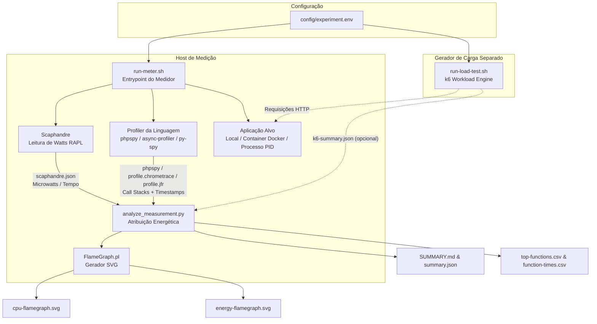

# Green Energy Lab — Medidor Multi-Linguagem de Energia e Performance

O **Green Energy Lab** é uma ferramenta de perfilamento e medição de consumo energético e emissões de carbono para aplicações de software em sistemas Linux nativos.

Ele integra medição direta de hardware via contadores Intel/AMD RAPL (**Scaphandre**), perfilamento de pilhas de chamadas em tempo de execução (**phpspy** para PHP, **async-profiler** para Java, **py-spy** para Python), geração de perfil visual (**FlameGraph**), testes de carga desacoplados (**k6**) e um analisador estatístico em Python (`analyze_measurement.py`) que correlaciona o consumo elétrico com o código executado.

Este guia assume que você vai usar a ferramenta para medir uma aplicação real em produção/homologação, não apenas a aplicação de teste embutida no repositório.

---

## 📋 Sumário
1. [Requisito Fundamental](#-requisito-fundamental)
2. [Arquitetura e Fluxo Desacoplado](#-arquitetura-e-fluxo-desacoplado)
3. [Instalação (Passo a Passo)](#-instalação-passo-a-passo)
4. [Conceitos-Chave Antes de Medir](#-conceitos-chave-antes-de-medir)
5. [Guia Rápido: Validando a Instalação com a Aplicação de Teste](#-guia-rápido-validando-a-instalação-com-a-aplicação-de-teste)
6. [Modos de Execução do Medidor (`run-meter.sh`)](#-modos-de-execução-do-medidor-run-metersh)
7. [🐳 Suporte a Containers Docker e Pools Multi-Processo](#-suporte-a-containers-docker-e-pools-multi-processo)
8. [📚 Guia Completo: Medindo uma Aplicação Real em Produção](#-guia-completo-medindo-uma-aplicação-real-em-produção)
9. [🎯 Filtro de Escopo da Aplicação (Application Scope Filtering)](#-filtro-de-escopo-da-aplicação-application-scope-filtering)
10. [⚡ Execução Separada do Teste de Carga (`run-load-test.sh`)](#-execução-separada-do-teste-de-carga-run-load-testsh)
11. [📊 Painel Visual Interativo](#-painel-visual-interativo)
12. [⚙️ Configuração (`config/experiment.env`)](#-configuração-configexperimentenv)
13. [📁 Estrutura do Repositório](#-estrutura-do-repositório)
14. [🧮 Calculadora de Carbono (`carbon.py`)](#-calculadora-de-carbono-carbonpy)
15. [📌 Boas Práticas de Medição](#-boas-práticas-de-medição)
16. [🩹 Solução de Problemas](#-solução-de-problemas)

---

## ⚠️ Requisito Fundamental

> [!IMPORTANT]
> **Use Linux nativo instalado no computador físico.**
>
> **Não use WSL nem Máquinas Virtuais comuns** para realizar as medições reais de energia. O Scaphandre depende das interfaces RAPL (Running Average Power Limit) fornecidas pelo kernel Linux (`/sys/class/powercap`), que normalmente **não são expostas** por hipervisores ou pelo WSL. Isso normalmente significa medir diretamente no servidor físico (ou em um servidor de homologação com acesso físico), não em uma VM de nuvem comum.

Requisitos adicionais:
- Privilégios de **`sudo`** para acessar os contadores de hardware RAPL e ler memória de processos via `process_vm_readv`.
- Para PHP: PHP compilado **sem Thread Safety (Non-ZTS)** para compatibilidade com o profiler `phpspy` (padrão nos pacotes `php-cli` do Ubuntu/Debian).
- Para Java: JDK instalado (não apenas JRE), pois o parser usa a ferramenta `jfr` do próprio JDK.
- CPU Intel ou AMD com suporte a RAPL (praticamente todo processador desktop/servidor moderno).

---

## 🏗 Arquitetura e Fluxo Desacoplado

O sistema adota uma separação estrita de responsabilidades: **Medição** e **Geração de Carga** são processos totalmente independentes. Isso permite executar o gerador de tráfego HTTP (`k6`) em um computador ou terminal separado, garantindo que o consumo de CPU do `k6` não interfira nas leituras de energia do servidor sob teste.



### Suporte Multi-Linguagem Integrado (PHP, Java, Python)

O medidor unifica os três ecossistemas em uma interface padronizada de linha de comando:

```bash
./run-meter.sh --language <php|java|python> --mode <local|container|process>
```

- **PHP**: Utiliza amostragem de pilhas de execução via `phpspy` a 99 Hz + medição RAPL com Scaphandre.
- **Java**: Utiliza perfilamento nativo da JVM via `async-profiler` (formato JFR) + parser JDK `jfr` + medição RAPL.
- **Python**: Utiliza amostragem de pilhas em tempo real via `py-spy` (formato chrometrace) + medição RAPL.

---

## 🚀 Instalação (Passo a Passo)

Estes passos devem ser executados **na máquina física** que vai hospedar a medição (o servidor onde a aplicação roda, ou uma máquina de homologação equivalente com acesso físico).

### 1. Clonar o repositório
```bash
git clone <url-do-repositório> green-energy-lab
cd green-energy-lab
```

### 2. Instalar as dependências (Ubuntu/Debian)
```bash
./measurement/install-tools-ubuntu.sh
```
Esse script instala/baixa: `scaphandre`, `phpspy`, `FlameGraph`, `async-profiler`, `k6`, `py-spy`, além de dependências de sistema (`php-cli`, `python3`, `default-jdk-headless`, `perl`, etc). Ele é idempotente — pode ser executado novamente sem duplicar instalações.

> As ferramentas de terceiros baixadas (phpspy, FlameGraph, async-profiler) ficam em `tools/` e **não são versionadas no git** — cada máquina precisa rodar este instalador uma vez.

### 3. Verificar o ambiente
```bash
./measurement/check-environment.sh
```
Esse script confirma que: o kernel expõe os contadores RAPL, o Scaphandre consegue gerar uma amostra real, o PHP não está com Thread Safety habilitado, e as demais ferramentas (`py-spy`, `async-profiler`, `jfr`) estão disponíveis. Se ele falhar, resolva o item apontado antes de prosseguir — sem RAPL, os números de energia não têm significado.

### 4. Validar a instalação com a aplicação de teste
Antes de apontar para uma aplicação real, rode uma medição completa contra a mini-aplicação embutida (veja a seção seguinte). Isso confirma que `sudo`, RAPL, o profiler da linguagem e o `k6` estão todos funcionando corretamente, isolando qualquer problema de configuração da aplicação real que você for medir depois.

---

## 🧭 Conceitos-Chave Antes de Medir

Antes de rodar contra uma aplicação real, é importante entender três decisões que o medidor pede em toda execução:

| Conceito | Pergunta que responde | Exemplos |
|---|---|---|
| **Linguagem** (`--language`) | Em que runtime a aplicação roda? | `php`, `java`, `python` |
| **Modo** (`--mode`) | Como o medidor encontra o processo a perfilar? | `local` (inicia o servidor), `container` (aponta para um container Docker já rodando), `process` (aponta para um PID já existente no host) |
| **Escopo da aplicação** (`--application-prefix` + `--project-root`) | Quais funções são "código de negócio" e quais são "framework/infraestrutura"? | `App\` (PHP/Laravel), `com.empresa.sistema` (pacote Java), `meuapp.` (módulo Python) |

Para uma aplicação real em produção, o modo mais comum é **`container`** (se ela roda em Docker) ou **`process`** (se você já sabe o PID do processo Java/PHP no servidor). O modo `local` é usado principalmente para a aplicação de teste embutida.

O `--application-prefix` **é sempre obrigatório**, em qualquer linguagem/modo — sem ele o medidor não sabe separar "código da aplicação" de "biblioteca/framework/JVM interna", e a atribuição de energia por função fica sem sentido. Veja a seção [Filtro de Escopo](#-filtro-de-escopo-da-aplicação-application-scope-filtering) para como descobrir o prefixo certo.

---

## ⚡ Guia Rápido: Validando a Instalação com a Aplicação de Teste

O repositório inclui uma mini-aplicação idêntica em três linguagens (`public/index.php`, `scripts/python-server.py`, `scripts/JavaServer.java`), usada apenas para validar a cadeia de medição de ponta a ponta antes de medir uma aplicação real.

### 1. Iniciar o Medidor (Terminal 1)
```bash
./run-meter.sh --language php --mode local --application-prefix "public." --project-root . -d 30 -b 10
```
*O script coletará o consumo em repouso (baseline) por 10s e abrirá uma janela de medição de 30s.*

### 2. Executar o Teste de Carga (Terminal 2)
Assim que o Terminal 1 avisar que a janela de medição está aberta:
```bash
./run-load-test.sh mixed --duration 30
```

### 3. Ver o resultado
```bash
cat results/php-local-<timestamp>/SUMMARY.md
```
Ou abra o [painel visual](#-painel-visual-interativo) para navegar pelos flamegraphs.

Se esse fluxo funcionar de ponta a ponta (baseline → carga → `SUMMARY.md` com números diferentes de zero), a instalação está pronta para medir uma aplicação real.

---

## 🎯 Modos de Execução do Medidor (`run-meter.sh`)

### 1. Modo Local (`--mode local`)
Inicia automaticamente o servidor de aplicação local e anexa o profiler ao processo criado:
```bash
./run-meter.sh --language php --mode local --application-prefix "App\\" --project-root .
./run-meter.sh --language python --mode local --application-prefix "meuapp." --project-root .
./run-meter.sh --language java --mode local --application-prefix "com.minhaempresa" --app-cmd "java -jar app.jar"
```

### 2. Modo Container Docker (`--mode container`)
Identifica o PID do container no Host Linux através de `docker inspect` e monitora o container diretamente pelo Host:
```bash
./run-meter.sh --language php --mode container -c nome_container_php --application-prefix "App\\" --project-root /caminho/do/codigo
./run-meter.sh --language python --mode container -c nome_container_python --application-prefix "meuapp." --project-root /caminho/do/codigo
./run-meter.sh --language java --mode container -c nome_container_java --application-prefix "com.minhaempresa"
```

### 3. Modo Processo Específico (`--mode process`)
Conecta os coletores diretamente a um processo existente no Linux através do seu PID:
```bash
./run-meter.sh --language php --mode process -p 12345 --application-prefix "App\\" --project-root /caminho/do/codigo
./run-meter.sh --language python --mode process -p 23456 --application-prefix "meuapp." --project-root /caminho/do/codigo
./run-meter.sh --language java --mode process -p 34567 --application-prefix "com.minhaempresa"
```

### Opções do `run-meter.sh`:
| Parâmetro | Descrição | Padrão |
|---|---|---|
| `-l, --language <lang>` | Linguagem da aplicação (`php`, `java`, `python`) | `php` |
| `-m, --mode <mode>` | Modo de execução (`local`, `container`, `process`) | `local` |
| `-c, --container <nome>` | Nome ou ID do container Docker (para modo container) | - |
| `-p, --pid <pid>` | PID do processo alvo no Host (para modo process) | - |
| `--port <porta>` | Porta TCP para execução do servidor no modo local | `8080` |
| `--host <host>` | Endereço de host para o servidor local | `127.0.0.1` |
| `--app-cmd <comando>` | Comando customizado para iniciar a aplicação localmente | - |
| `-d, --duration <seg>` | Duração da janela de medição em segundos | `60` |
| `-b, --baseline <seg>` | Duração da medição em repouso (*baseline*) | `15` |
| `-o, --output <dir>` | Diretório customizado de saída para os resultados | `results/...` |
| `--prefix, --application-prefix <prefs>` | **Obrigatório.** Filtra funções por um ou múltiplos prefixos separados por vírgula (ex: `api,service` ou `App\,Domain\`) | - |
| `--project-root <dir>` | Raiz do código-fonte para qualificação dos frames (obrigatório para PHP/Python) | - |
| `--config <arquivo>` | Caminho do arquivo de configuração `.env` | `config/experiment.env` |
| `--k6 <arquivo>` | Caminho do resumo gerado pelo k6 (`k6-summary.json`) | `results/k6-summary.json` |

Rode `./run-meter.sh --help` a qualquer momento para ver a lista completa e atualizada.

---

## 🐳 Suporte a Containers Docker e Pools Multi-Processo

Em aplicações de produção (PHP-FPM, Java em containers, pools de workers Python), o servidor opera tipicamente através de um gerenciador de processos que cria e recicla workers dinamicamente, frequentemente orquestrado por supervisores de container como **s6-overlay**, **systemd**, **supervisord** ou **tini**.

### O Desafio da Reciclagem de Processos (*Worker Recycling*)
Conforme a carga de requisições varia:
1. O gerenciador de processos cria e destrói workers dinamicamente.
2. Anexar o profiler a um único PID efêmero (`-p PID`) faz com que o perfilamento seja **interrompido abruptamente** assim que aquele worker específico é reciclado.
3. Se houver um vácuo de amostragem durante o encerramento do processo, algoritmos ingênuos de interpolação trapezoidal podem esticar linearmente a energia de dezenas de segundos sobre as poucas funções capturadas nos momentos finais, distorcendo os relatórios e inflando métricas.

### O que a Ferramenta Faz a Respeito:

1. **Profiling Concorrente de Pool (`phpspy -P`)**:
   Em modo container, o medidor utiliza `-P "php-fpm|php"` com múltiplas threads (`-T 16`), modo tolerante a falhas (`-c`) e sincronização por mutex (`-J m`). O profiler rastreia simultaneamente todos os workers ativos e anexa automaticamente aos novos workers que nascem durante picos de estresse.

2. **`py-spy --subprocesses`**:
   Servidores WSGI/ASGI multi-worker (gunicorn, uvicorn, uwsgi, granian) atendem requisições em processos filhos forkados do master; o medidor sempre inclui `--subprocesses` para capturar os workers reais, não apenas o processo coordenador.

3. **Agregação Temporal no Scaphandre**:
   O [analyze_measurement.py](measurement/analyze_measurement.py) agrupa a potência de todos os processos da aplicação por timestamp de snapshot de relatório, somando o consumo elétrico de todo o cluster de workers e processos filhos.

4. **Proteção contra Gaps de Amostragem (`max_interval_gap_s = 3.0s`)**:
   Caso ocorra alguma descontinuidade na amostragem de hardware, o integrador classifica o intervalo como *unattributed*, impedindo que funções pontuais (como providers de boot) recebam custos energéticos indevidos.

5. **Resolução de Processos Ignorando Supervisores**:
   O [run-meter.sh](measurement/run-meter.sh) inspeciona os processos do container via `docker top`, filtrando executáveis de supervisão (`s6-svscan`, `s6-supervise`, `s6-linux-init`) e capturando os processos de aplicação reais.

6. **Java em Container**: como o mecanismo de attach dinâmico do `async-profiler` precisa rodar dentro do mesmo namespace da JVM, o medidor copia o `asprof` para dentro do container via `docker cp` e executa o profiling com `docker exec`, trazendo o `.jfr` de volta ao final.

---

## 📚 Guia Completo: Medindo uma Aplicação Real em Produção

Este é o roteiro para medir uma aplicação real (não apenas a aplicação de teste embutida). Os passos abaixo assumem uma aplicação Java rodando atrás de um servidor de aplicação em container (`--language java --mode container`), mas o mesmo roteiro vale para qualquer aplicação PHP/Python trocando a linguagem e as flags correspondentes, ou para `--mode process` caso a aplicação rode direto no host.

### Passo 0 — Levante estas informações antes do dia da medição
- Em qual servidor físico a aplicação roda, e você tem acesso `sudo` nele para instalar as ferramentas e ler os contadores RAPL?
- A aplicação roda em container Docker (`--mode container`) ou como processo direto no host (`--mode process`)? Se for container, qual o nome/ID dele (`docker ps`)?
- Existe um ambiente de homologação com tráfego representativo, ou a medição vai ocorrer em produção? Se for produção, combine com os responsáveis pela operação uma janela de baixo risco antes de rodar qualquer teste de carga.
- Qual o pacote/namespace raiz do código da aplicação (ex: `com.empresa.sistema`)? Isso vira o `--application-prefix`. Se não souber, rode a medição sem carga com um prefixo qualquer primeiro e inspecione o `cpu-flamegraph.svg` gerado para descobrir o pacote real nos frames capturados.

### Passo 1 — Instalar e validar a ferramenta no servidor
Siga a seção [Instalação](#-instalação-passo-a-passo) inteira nesse servidor, incluindo o guia rápido com a aplicação de teste, **antes** de tentar medir a aplicação real. Isso evita perder tempo depurando RAPL/sudo/phpspy durante a janela de medição real.

### Passo 2 — Identificar o alvo
```bash
docker ps                      # se a aplicação roda em container, confirme o nome
docker top <nome_do_container>  -o pid,comm,args   # veja o processo java real dentro do container
# ou, se for processo direto no host:
pgrep -fl java
```

### Passo 3 — Escrever um script de carga k6 para a aplicação real
O `k6.js` incluído no repositório só sabe conversar com a mini-aplicação de teste (`/work?workload=...`) — ele **não serve para medir uma aplicação real**. Escreva um script novo (ex: `app-load-test.js`) usando `k6.js` como esqueleto/referência de `handleSummary` e `Counter`, substituindo o corpo de `export default function()` pelas rotas reais que você quer exercitar (ex: tela de login, uma consulta, um relatório). Um esqueleto mínimo:

```javascript
import http from 'k6/http';
import { check } from 'k6';

const BASE_URL = __ENV.BASE_URL || 'https://app.exemplo.org';

export const options = {
  scenarios: {
    measured_workload: {
      executor: 'constant-arrival-rate',
      rate: Number(__ENV.RATE || 2),
      timeUnit: '1s',
      duration: `${__ENV.DURATION_SECONDS || 60}s`,
      preAllocatedVUs: 10,
      maxVUs: 50,
    },
  },
};

export default function () {
  const res = http.get(`${BASE_URL}/login`); // ajuste para a rota real
  check(res, { 'status 200': (r) => r.status === 200 });
}

export function handleSummary(data) {
  return { [__ENV.SUMMARY_PATH || 'results/k6-summary.json']: JSON.stringify(data, null, 2) };
}
```

> Combine com os responsáveis pela aplicação qual nível de carga é seguro gerar (rota, taxa de requisições, se pode ser em produção). Nunca gere carga não combinada contra um sistema em produção.

### Passo 4 — Iniciar o Medidor (Terminal 1, no servidor)
```bash
./run-meter.sh \
  --language java \
  --mode container \
  -c nome_do_container \
  --application-prefix "com.empresa.sistema" \
  -d 180 \
  -b 15
```

### Passo 5 — Executar o Teste de Carga (Terminal 2)
Assim que o Terminal 1 iniciar a janela de medição, dispare o script que você escreveu no Passo 3:
```bash
./run-load-test.sh --script app-load-test.js --url https://app.exemplo.org --rate 2 --duration 180
```
Ou diretamente com `k6 run` se preferir controlar todos os parâmetros manualmente.

### Passo 6 — Interpretar os Resultados
Ao final da execução, abra o relatório em `results/java-container-YYYYMMDD-HHMMSS/SUMMARY.md`:
* **Separação de Camadas**: o Scaphandre isola o custo do runtime Java/servidor de aplicação do restante do host.
* **Custo por Requisição**: métrica fundamental de *Green Software*, expressa em **Joules por Requisição**.
* **Hotspots de Negócio**: identifique no `energy-flamegraph.svg` quais classes/métodos da aplicação acumulam maior pegada energética — são os melhores candidatos a refatoração para eficiência.

---

## 🎯 Filtro de Escopo da Aplicação (Application Scope Filtering)

Em ecossistemas modernos, grande parte das chamadas capturadas pelos profilers pertence à infraestrutura (middlewares internos, roteamento, serializadores, ORMs, chamadas de sistema ou bibliotecas de terceiros).

Para guiar a **refatoração verde (*Green Refactoring*)**, o medidor possui um mecanismo de **filtro de escopo multi-prefixo** agnóstico à linguagem que isola as funções de negócio da aplicação e agrupa o restante sob o rótulo `[framework/language overhead]`.

### Como descobrir o prefixo certo
Se você não sabe de antemão o namespace/pacote/módulo raiz da aplicação:
1. Rode uma medição curta (ex: `-d 20 -b 5`) com um prefixo qualquer (ex: o nome do sistema em minúsculas).
2. Abra o `cpu-flamegraph.svg` gerado — ele mostra **todos** os frames capturados, com nomes completos.
3. Identifique o prefixo comum das classes/funções que pertencem à aplicação (não a bibliotecas de terceiros) e rode novamente com o `--application-prefix` correto.

### Suporte a Múltiplos Prefixos (Separados por Vírgula)
Você pode especificar um ou múltiplos prefixos separados por vírgula (`prefixo1,prefixo2,prefixo3`). O analisador verifica se a função inicia com **qualquer um** dos prefixos configurados.

```bash
# Python: filtra múltiplos módulos / sub-apps de negócio
./run-meter.sh --language python --mode container -c backend \
  --project-root /code \
  --application-prefix "api,service,worker"

# PHP: filtra múltiplos namespaces do sistema
./run-meter.sh --language php --mode local \
  --project-root . \
  --application-prefix "App\\,Domain\\"

# Java: filtra múltiplos pacotes do projeto
./run-meter.sh --language java --mode local \
  --application-prefix "com.empresa.sistema,com.empresa.sistema.web"
```

Ou configure diretamente no arquivo de ambiente (ex: `config/experiment.env` ou uma cópia dele para a aplicação sob teste):
```env
APPLICATION_PREFIX=com.empresa.sistema
PROJECT_ROOT=/caminho/do/codigo
```

### Como o Analisador Trata os Escopos
1. **Funções no Escopo**: têm suas métricas de energia (`Self Energy` e `Inclusive Energy`) e tempo de execução contabilizados detalhadamente no `SUMMARY.md`, `summary.json` e `top-functions.csv`.
2. **Funções Fora do Escopo**: são colapsadas e consolidadas automaticamente como `[framework/language overhead]` nos FlameGraphs interativos (`energy-flamegraph.svg` e `cpu-flamegraph.svg`), evitando ruído visual de frameworks.

### Como Interpretar os Relatórios (`SUMMARY.md` e `top-functions.csv`)

| Métrica | Significado | Como Usar na Otimização |
|---|---|---|
| **Self Energy (J)** | Energia consumida **diretamente dentro do corpo da função** (excluindo chamadas filhas). | **Alvo nº 1 de otimização algorítmica**. Indica quais funções gastam mais CPU ativa internamente. |
| **Inclusive Energy (J)** | Energia da função **mais** toda a cadeia de chamadas que ela disparou. | **Alvo de otimização de arquitetura/fluxo**. Indica quais rotas ou controllers acumulam mais custo elétrico total. |
| **Average Time (ms/req)** | Latência média adicionada à requisição por aquela função. | Ajuda a verificar se a lentidão da API está diretamente associada ao alto consumo de Joules. |

---

## ⚡ Execução Separada do Teste de Carga (`run-load-test.sh`)

O script `run-load-test.sh` executa o `k6` de forma independente, seja com o workload sintético embutido (útil para validar a instalação) ou com um script customizado apontando para a aplicação real:

```bash
# Executar o workload sintético padrão contra a aplicação de teste embutida
./run-load-test.sh

# Executar um tipo específico de workload sintético (cpu, text, wordpress, mixed)
./run-load-test.sh cpu

# Apontar para um script k6 customizado (ex: para medir uma aplicação real)
./run-load-test.sh --script app-load-test.js --url https://app.exemplo.org --rate 2 --duration 180
```

### Opções do `run-load-test.sh`:
| Parâmetro | Descrição | Padrão |
|---|---|---|
| `-u, --url <url>` | URL base da aplicação sob teste | `http://127.0.0.1:8080` |
| `-w, --workload <tipo>` | Tipo de workload sintético (`cpu`, `text`, `wordpress`, `mixed`) — ignorado se `--script` for usado | `mixed` |
| `--script <arquivo>` | Script k6 customizado (necessário para medir uma aplicação real) | `k6.js` |
| `-r, --rate <req/s>` | Taxa constante de requisições por segundo | `2` |
| `-d, --duration <seg>` | Duração do teste de carga em segundos | `60` |
| `-s, --scale <escala>` | Fator de escala do peso computacional (1 a 5, só afeta o workload sintético) | `1` |
| `--warmup <seg>` | Duração de aquecimento prévio opcional | `0` |
| `-o, --output <arquivo>` | Caminho para salvar o `k6-summary.json` | `results/k6-summary.json` |

---

## 📊 Painel Visual Interativo

O projeto conta com um painel web interativo para visualização de resultados:

1. Inicie o servidor da interface:
```bash
./scripts/start-server.sh
```
2. Abra o navegador em `http://127.0.0.1:8080/`.
3. Navegue pelas execuções passadas no menu lateral e visualize:
   - **Métricas de Energia**: Total do Host, Total do Processo e Energia Dinâmica (com desconto de baseline).
   - **Potência Média (Watts)** e **Emissões de Carbono Estimadas ($g\text{CO}_2e$)**.
   - **Flamegraph Interativo de Energia**: Atribuição de microjoules por função.
   - **Flamegraph Interativo de CPU**: Amostras de tempo de execução por pilha de chamadas.

---

## ⚙️ Configuração (`config/experiment.env`)

O arquivo `config/experiment.env` centraliza as configurações padrão (hoje calibrado para a aplicação de teste embutida). Para medir uma aplicação real, copie-o (ex: `config/producao.env`) e ajuste os valores, depois use `./run-meter.sh --config config/producao.env`.

```env
TARGET_LANGUAGE=php
MODE=local

HOST=127.0.0.1
PORT=8080
BASE_URL=http://127.0.0.1:8080

APPLICATION_PREFIX=public.
PROJECT_ROOT=.

WORKLOAD=mixed
SCALE=1
RATE=2

DURATION_SECONDS=60
WARMUP_SECONDS=10
BASELINE_SECONDS=15
COLLECTOR_LEAD_SECONDS=3
COLLECTOR_TAIL_SECONDS=5

PHPSPY_RATE_HZ=99
PYSPY_RATE_HZ=100
SCAPHANDRE_STEP_SECONDS=1
SCAPHANDRE_PROCESS_REGEX="(php|mysqld|mariadbd|apache2)"
SCAPHANDRE_MAX_PROCESSES=100

CARBON_INTENSITY_G_PER_KWH=100
```

`SCAPHANDRE_PROCESS_REGEX` controla quais processos do host entram na soma de energia — para uma aplicação Java, ajuste para algo como `"(java|jvm)"`, ou mantenha o padrão de auto-detecção por linguagem do `run-meter.sh` simplesmente deixando esta variável sem alterações (ele já escolhe uma regex adequada por linguagem quando o valor é o padrão de fábrica).

`CARBON_INTENSITY_G_PER_KWH` é a intensidade de carbono da matriz elétrica local (gCO₂e por kWh) — ajuste para o valor mais recente da matriz elétrica brasileira/regional se quiser emissões mais precisas (o valor de fábrica, 100, é apenas um placeholder).

---

## 📁 Estrutura do Repositório

```text
green-energy-lab/
├── README.md                   # Este guia
├── run-meter.sh                # Entrypoint universal do medidor (PHP, Java, Python)
├── run-load-test.sh            # Entrypoint do gerador de carga (k6)
├── carbon.py                   # Calculadora standalone de emissões de carbono
├── k6.js                       # Script k6 do workload sintético (validação da instalação)
├── config/
│   └── experiment.env          # Arquivo de configuração de parâmetros (copie para cada app medida)
├── measurement/
│   ├── run-meter.sh            # Engine de medição e acoplamento de coletores
│   ├── run-load-test.sh        # Engine de execução do k6
│   ├── analyze_measurement.py  # Analisador de correlação temporal de energia e stacks
│   ├── application_scope.py    # Filtro de escopo (application-prefix) agnóstico à linguagem
│   ├── frame_naming.py         # Qualificação de nomes de frame para PHP/Python
│   ├── jfr_parser.py           # Parser do profile.jfr (Java)
│   ├── pyspy_parser.py         # Parser do profile.chrometrace.json (Python)
│   ├── check-environment.sh    # Validação do ambiente e contadores RAPL
│   ├── install-tools-ubuntu.sh # Instalador de dependências no Ubuntu Linux
│   ├── test-analyzer.sh        # Testes automatizados do analisador
│   └── test-fixtures/          # Conjunto de dados de teste para validação
├── public/
│   └── index.php               # Aplicação PHP de teste + painel visual interativo
├── scripts/
│   ├── start-server.sh         # Utilitário para iniciar o painel web
│   ├── python-server.py        # Aplicação Python de teste (equivalente ao index.php)
│   └── JavaServer.java         # Aplicação Java de teste (equivalente ao index.php)
├── tools/                      # Ferramentas de terceiros baixadas pelo instalador (não versionado)
│   ├── FlameGraph/             # Renderizador SVG de Flamegraphs
│   ├── phpspy/                 # Profiler de call stacks para PHP
│   └── async-profiler/         # Profiler nativo da JVM (Java)
└── results/                    # Diretório onde são gravados os relatórios de medição (não versionado)
```

---

## 🧮 Calculadora de Carbono (`carbon.py`)

Utilitário de linha de comando para conversão direta de Joules em emissões operacionais, sem precisar rodar uma medição completa:

```bash
./carbon.py --energy-j 125.5 --carbon-intensity 100 --requests 120
```

---

## 📌 Boas Práticas de Medição

1. **Desacoplamento de Carga**: execute o gerador `run-load-test.sh` em um computador cliente separado na rede sempre que possível, para garantir isolamento elétrico completo dos contadores RAPL.
2. **Repetição de Medições**: realize no mínimo 5 repetições para cada medição experimental a fim de obter significância estatística.
3. **Desconto de Baseline**: o medidor desconta automaticamente a taxa de consumo elétrico da máquina em repouso (*idle baseline*), gerando a métrica de **energia dinâmica**. Não pule o baseline (`-b`) em medições que você pretende comparar entre si.
4. **Coordenação em Produção**: se a aplicação medida estiver em produção, combine com os responsáveis pela operação a janela de horário, o nível de carga gerado e tenha um plano de rollback antes de rodar qualquer teste.
5. **Isolamento de Ruído**: evite rodar outras cargas de trabalho pesadas na mesma máquina durante a medição — elas também são contabilizadas pelo RAPL e distorcem os números do host.

---

## 🩹 Solução de Problemas

| Sintoma | Causa provável | Solução |
|---|---|---|
| `check-environment.sh` falha em "No RAPL energy_uj counters found" | Rodando em VM/WSL, ou módulo do kernel não carregado | Use um computador físico; rode `sudo modprobe intel_rapl_common` e `intel_rapl_msr` |
| `phpspy não encontrado` | Instalador não rodou ou `tools/` foi apagado | Rode `./measurement/install-tools-ubuntu.sh` novamente |
| `Erro: --application-prefix é obrigatório` | Faltou informar o filtro de escopo | Veja [Filtro de Escopo](#-filtro-de-escopo-da-aplicação-application-scope-filtering) para descobrir o prefixo correto |
| `SUMMARY.md` com energia zerada ou flamegraph vazio | O profiler não capturou nenhuma amostra (processo errado, ou aplicação ociosa durante a janela) | Confirme o PID/container correto com `docker top`/`pgrep`, e garanta que o `run-load-test.sh` (ou tráfego real) esteja rodando durante a janela de medição |
| `jfr` não encontrado | Apenas o JRE está instalado, não o JDK | Instale `default-jdk-headless` ou equivalente; para containers, o medidor tenta usar o `jfr` de dentro do container automaticamente |
