# 🏛️ Guia de Medição de Eficiência Energética e TI Verde na STI / UFPB

Este guia orienta a aplicação prática do **Green Energy Lab** na infraestrutura da **Superintendência de Tecnologia da Informação (STI) da Universidade Federal da Paraíba (UFPB)**.

O laboratório está preparado para cobrir todos os sistemas e linguagens utilizados na universidade:
* **Java / J2EE / JVM (SIGs: SIGAA, SIPAC, SIGRH, Spring Boot, Tomcat, WildFly)**
* **PHP (Portal Institucional UFPB, WordPress, Laravel, BookStack Wiki STI)**
* **Python (APIs REST, FastAPI, Django, Pipelines de Dados da STI)**
* **Infraestrutura de Virtualização (Proxmox VE, KVM, Docker no Data Center)**

---

## 📋 Sumário
1. [As Três Abordagens de Medição](#-as-três-abordagens-de-medição)
2. [Abordagem 1: Staging / Sandbox Bare-Metal (Recomendada)](#-abordagem-1-staging--sandbox-bare-metal-recomendada)
3. [Abordagem 2: Medição no Nó Hypervisor do Data Center (Proxmox/KVM)](#-abordagem-2-medição-no-nó-hypervisor-do-data-center-proxmoxkvm)
4. [Abordagem 3: Medição de Processo Local / VM Dedicada](#-abordagem-3-medição-de-processo-local--vm-dedicada)
5. [Cenários de Teste de Carga Específicos da UFPB](#-cenários-de-teste-de-carga-específicos-da-ufpb)
6. [Intensidade de Carbono Regional (SIN / Nordeste)](#-intensidade-de-carbono-regional-sin--nordeste)
7. [Boas Práticas para Servidores Java (Evitar Safepoint Bias)](#-boas-práticas-para-servidores-java-evitar-safepoint-bias)

---

## 🎯 As Três Abordagens de Medição

```mermaid
flowchart TD
    subgraph A1["Abordagem 1: Staging Bare-Metal (Recomendada)"]
        BM["Servidor Físico de Laboratório (Linux Nativo)"]
        DOCK["Containers dos Sistemas UFPB (SIGAA / SIPAC / Portal)"]
        M1["run-meter.sh + Scaphandre + Profiler da Linguagem"]
        BM --> DOCK --> M1
    end

    subgraph A2["Abordagem 2: Hypervisor Data Center"]
        PROX["Nó Físico Proxmox / KVM no Data Center"]
        VMS["VMs de Produção / Homologação (qemu/kvm)"]
        M2["Scaphandre RAPL (Mapeia Watts por VM/PID)"]
        PROX --> VMS --> M2
    end

    subgraph A3["Abordagem 3: Processo Direto (PID)"]
        PROC["Processo Java/PHP/Python em Execução"]
        M3["run-meter.sh --mode process -p PID"]
        PROC --> M3
    end
```



---

## 🚀 Abordagem 1: Staging / Sandbox Bare-Metal (Recomendada)

Ideal para **pesquisa, benchmarking e refatoração verde (*Green Refactoring*)** sem risco de indisponibilidade em sistemas de produção.

### 1.1 Medindo o SIGAA (Java / Tomcat / PostgreSQL)
1. Certifique-se de que o container do SIGAA está rodando (ex: `sigaa_backend`):
   ```bash
   docker ps
   ```
2. Inicie o medidor no **Terminal 1** usando a configuração pronta:
   ```bash
   ./run-meter.sh -c config/ufpb-sigaa.env
   ```
3. Dispare o teste de carga no **Terminal 2** (simula navegação discente, turmas e emissão de histórico):
   ```bash
   ./run-load-test.sh -c config/ufpb-sigaa.env
   ```

---

### 1.2 Medindo o SIPAC (Java / Protocolo / Processos Administrativos)
1. Inicie o medidor no **Terminal 1**:
   ```bash
   ./run-meter.sh -c config/ufpb-sipac.env
   ```
2. Dispare a carga no **Terminal 2** (simula busca de processos, mesa virtual e requisições):
   ```bash
   ./run-load-test.sh -c config/ufpb-sipac.env
   ```

---

### 1.3 Medindo o Portal Institucional da UFPB (PHP / WordPress / Nginx)
1. Inicie o medidor no **Terminal 1**:
   ```bash
   ./run-meter.sh -c config/ufpb-portal-php.env
   ```
2. Dispare a carga no **Terminal 2** (simula home, busca de editais e downloads):
   ```bash
   ./run-load-test.sh -c config/ufpb-portal-php.env
   ```

---

### 1.4 Medindo APIs e Microsserviços da STI (Python / FastAPI / Django)
1. Inicie o medidor no **Terminal 1**:
   ```bash
   ./run-meter.sh -c config/ufpb-api-python.env
   ```
2. Dispare a carga no **Terminal 2**:
   ```bash
   ./run-load-test.sh -c config/ufpb-api-python.env
   ```

---

## 🏢 Abordagem 2: Medição no Nó Hypervisor do Data Center (Proxmox/KVM)

Quando a aplicação roda em Máquinas Virtuais no Data Center da UFPB, o Scaphandre deve ser executado no **host físico do hypervisor** (onde o kernel Linux tem acesso direto aos contadores Intel/AMD RAPL).

1. No servidor host Proxmox/KVM, use a configuração de host:
   ```bash
   ./run-meter.sh -c config/ufpb-hypervisor-host.env
   ```
2. O Scaphandre isolará o consumo em Watts de cada processo `qemu-system-x86_64` (correspondente a cada VM do SIGAA, SIPAC ou Banco de Dados).

---

## ⚙️ Abordagem 3: Medição de Processo Local / VM Dedicada

Se você tiver um processo Java ou PHP rodando diretamente na máquina (sem container):
```bash
# Anexar a uma JVM do Tomcat / WildFly (PID 12345)
./run-meter.sh \
  --language java \
  --mode process \
  -p 12345 \
  --application-prefix "br.ufpb,br.ufrn" \
  -d 120 -b 20
```

---

## 🧪 Cenários de Teste de Carga Específicos da UFPB

O laboratório inclui scripts `k6` customizados para as operações da UFPB:

| Script | Sistema Alvo | Jornadas Simuladas |
| :--- | :--- | :--- |
| [`sigaa-load-test.js`](file:///home/vinicius/Documentos/Verdize/green-php-lab-meter-ready/sigaa-load-test.js) | **SIGAA** | 30% Portal Discente \| 30% Turmas e Notas \| 25% Emissão de Histórico/Declaração (PDF) \| 15% Consulta Pública |
| [`sipac-load-test.js`](file:///home/vinicius/Documentos/Verdize/green-php-lab-meter-ready/sipac-load-test.js) | **SIPAC** | 40% Busca de Processos & Mesa Virtual \| 35% Requisições & Compras \| 25% Portal de Contratos |
| [`ufpb-portal-load-test.js`](file:///home/vinicius/Documentos/Verdize/green-php-lab-meter-ready/ufpb-portal-load-test.js) | **Portal Web** | 40% Home & Notícias \| 35% Busca de Editais & Concursos \| 25% Cursos & Graduação |

---

## 🌿 Intensidade de Carbono Regional (SIN / Nordeste)

O laboratório já incorpora os fatores de emissão oficiais do **Sistema Interligado Nacional (SIN)**:

| Preset | Região / Abrangência | Fator (gCO₂e / kWh) | Contexto |
| :--- | :--- | :---: | :--- |
| `sin-nordeste` / `ufpb` | **Paraíba / Nordeste** | **45.2** | Matriz com alta penetração de energia solar e eólica |
| `sin-brasil` | **Média Nacional (SIN)** | **61.7** | Média oficial ponderada do ONS/MCTI |
| `sin-sudeste` | **Sudeste / Centro-Oeste** | **68.4** | Matriz com maior participação térmica |

Para calcular emissões de qualquer teste:
```bash
python3 carbon.py --energy-j 1500 --preset ufpb --requests 300
```

---

## ☕ Boas Práticas para Servidores Java (Evitar Safepoint Bias)

Para que o `async-profiler` capture chamadas do SIGAA/SIPAC com precisão máxima dentro do Tomcat/WildFly:
Adicione as seguintes flags nas opções da JVM (`JAVA_OPTS` / `CATALINA_OPTS`):
```bash
-XX:+UnlockDiagnosticVMOptions -XX:+DebugNonSafepoints
```
*Isso garante que o profiler capture pilhas mesmo em código JIT altamente otimizado, sem distorções de safepoint.*

---

## 📊 Visualização dos Resultados
Após qualquer medição, visualize o painel interativo:
```bash
php -S 0.0.0.0:8000 -t public
```
Acesse `http://localhost:8000` para comparar execuções e visualizar os FlameGraphs de energia.
